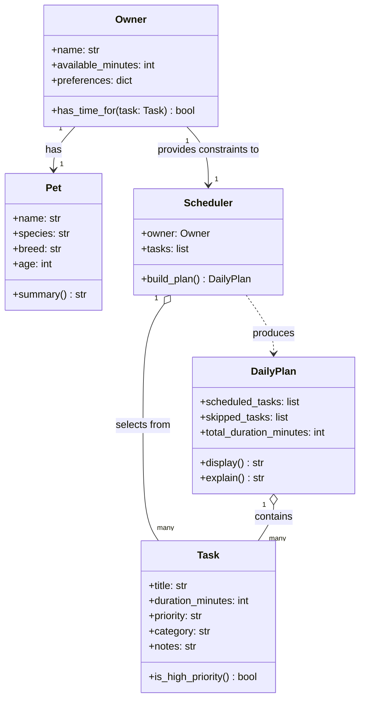

# PawPal+ Object Brainstorm

## Objects

### 1. `Task`
Represents a single pet care activity.

**Attributes:**
- `title` — name of the task (e.g., "Morning walk")
- `duration_minutes` — how long it takes
- `priority` — `"high"` / `"medium"` / `"low"`
- `category` — type of care (walk, feeding, medication, grooming, enrichment)
- `notes` — optional freeform details

**Methods:**
- `is_high_priority()` → bool — quick check used by scheduler
- `__repr__()` — readable string for display/debugging

---

### 2. `Pet`
Holds information about the animal being cared for.

**Attributes:**
- `name` — pet's name
- `species` — dog, cat, etc.
- `breed` — optional, influences default care needs
- `age` — affects task recommendations (puppy vs senior)

**Methods:**
- `summary()` → str — returns a human-readable description of the pet

---

### 3. `Owner`
Represents the person using the app and their constraints.

**Attributes:**
- `name` — owner's name
- `available_minutes` — total time available for pet care today
- `preferences` — dict or list of preferred task times or categories to prioritize

**Methods:**
- `has_time_for(task)` → bool — checks if a task fits within remaining available time

---

### 4. `Scheduler`
Core logic object — takes tasks + owner constraints and produces a plan.

**Attributes:**
- `owner` — the `Owner` instance
- `tasks` — list of `Task` objects to consider
- `scheduled_tasks` — list of tasks that made it into the plan
- `skipped_tasks` — list of tasks that were dropped and why

**Methods:**
- `build_plan()` → `DailyPlan` — runs the scheduling algorithm
- `_sort_by_priority(tasks)` — internal sort before scheduling
- `_fits_in_time(task, remaining)` → bool — checks duration against remaining budget

---

### 5. `DailyPlan`
The output of the scheduler — the finalized schedule for the day.

**Attributes:**
- `scheduled_tasks` — ordered list of `Task` objects
- `total_duration_minutes` — sum of all scheduled task durations
- `skipped_tasks` — tasks that didn't make the cut with reasons

**Methods:**
- `display()` → str — formats the plan for the UI
- `explain()` → str — narrates why tasks were included/excluded

---

## Relationship Summary

```
Owner ──── has ────► Pet
Owner ──── provides constraints to ────► Scheduler
Scheduler ── selects from ──► [Task, Task, ...]
Scheduler ── produces ──► DailyPlan
DailyPlan ── contains ──► [Task, Task, ...]
```

The `Scheduler` is the central actor — it takes `Owner` constraints, ranks and filters `Task` objects, and produces a `DailyPlan` that the UI displays.

---

## Class Diagram


